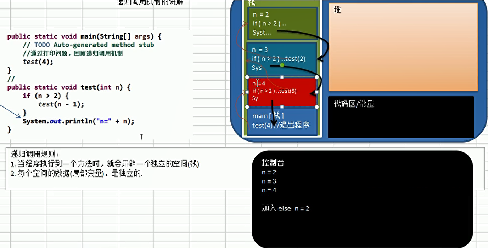
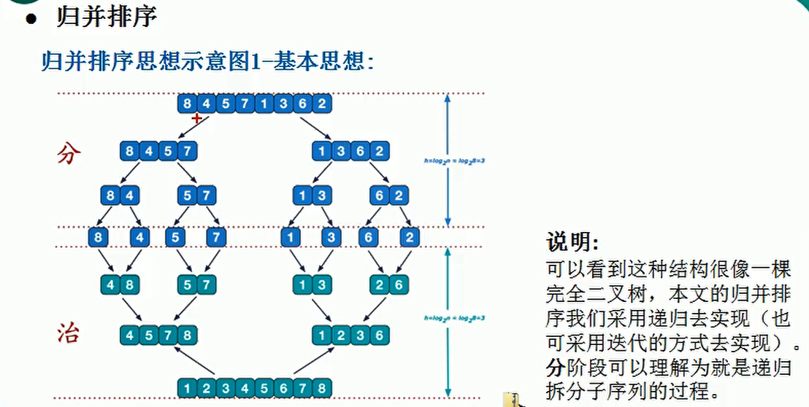

# 稀疏数组


# 数组模拟队列


数组模拟环形队列:(**==注意空出一个作为约定==**)


# 链表

## 单向链表


---


### 单向链表反转的思路:


```java
 //链表的反转: 新建一个链表, 将原来的链表第一个节点取下来, 接到新链表的head上, 第二个也接到head上, 它的next指向head.next
    public void reverseList() {
        //如果当前链表为空, 或者只有一个节点, 无需反转, 直接返回
        if (head.next == null || head.next.next == null) {
            return;
        }
        HeroNode cur = head.next;
        HeroNode next = null; //指向当前节点[cur]的下一个节点
        HeroNode reverseHead = new HeroNode(0, "", "");
        while (cur != null){
            next = cur.next;
            cur.next = reverseHead.next; //!!! cur的指向指向reverseHead的下一个
            reverseHead.next = cur;
            cur = next;
        }
        //将head.next指向reverseHead.next, 实现单链表的反转
        head.next = reverseHead.next;
    }
```


### 逆序打印单链表的思路:

==可以把单链表 从头到尾遍历一遍, 把每个节点保存起来, 可以保存到栈或者数组中, 然后再对他们进行遍历, 取出内容==


## 双向链表

### 增删改查思路


## 单向环形列表


构建和遍历环形链表的思路:


报数小孩出圈的顺序思路:(**==helper指针主要是定位到first的后一个, 重新形成环形队列==**)


# 栈


**==retrurn其实也是压栈的操作:==**


栈的思路:


**==用两个栈来计算一个表达式的结果的思路(中缀表达式)==**:


前缀表达式:


后缀表达式:


编写一个逆波兰计算器(后缀表达式):

```java
package com.atguigu.stack;

import java.util.ArrayList;
import java.util.List;
import java.util.Stack;

/**
 * @Author jacklu
 * @Date 13:08:20 2021/03/22
 */
public class PolandNotation {
    public static void main(String[] args) {
        //定义一个逆波兰表达式
        //(3+4)×5 => "3 4 + 5 × 6 -"
        //说明为了方便, 逆波兰表达式的数字和符号使用空格隔开
        String suffixExpression = "3 4 + 5 * 6 -";
        List<String> rpnList = getListString(suffixExpression);
        int calculate = calculate(rpnList);
        System.out.println(calculate);

    }

    //将一个逆波兰表达式装入list中
    public static List<String> getListString(String suffixExpression) {
        String[] strings = suffixExpression.split(" ");
        ArrayList<String> list = new ArrayList<>();
        for (String string : strings) {
            list.add(string);
        }
        return list;
    }

    /**
     * 逆波兰表达式的运算步骤:
     * 1. 从左至右扫描, 将3和4压入栈
     * 2. 遇到+运算符, 因此弹出3和4(4为栈顶元素, 3为次顶元素)计算出3+4的值, 然后将值压入栈中
     * 3. 将5入栈
     * 4. 接下来就是×运算, 因此弹出5和7相乘, 然后结果入栈
     * 5. 最后是-运算符, 数栈弹出两个数, 次栈顶减去栈顶得出结果
     * @param ls
     * @return
     */
    public static int calculate(List<String> ls){
        //创建一个栈, 只需要一个栈即可
        Stack<String> stack = new Stack<>();
        for (String item : ls) {
            //这里使用正则表达式取出整数
            if(item.matches("\\d+")){//如果是整数
                stack.push(item);
            }else {
                //pop出两个数, 并进行运算, 后面的数对前面的数进行操作, 然后结果再入栈
                int num2 = Integer.parseInt(stack.pop());
                int num1 = Integer.parseInt(stack.pop());
                int res = 0;
                if(item.equals("+")){
                    res = num1 + num2;
                }else if(item.equals("-")){
                    res = num1 - num2;
                }else if(item.equals("*")){
                    res = num1 * num2;
                }else if(item.equals("/")){
                    res = num1 / num2;
                }else {
                    throw new RuntimeException("运算符有误");
                }
                stack.push(""+res);
            }
        }
        //遍历完成之后就可以得出结果了
        return Integer.parseInt(stack.pop());
    }
}
```


中缀表达式转后缀表达式(**==(3+4)×5 => "3 4 + 5 × 6 -"==**):


# 递归



 

迷宫问题:


八皇后问题:


# 排序算法


## 冒泡排序的优化:

**==就是当一次循环下来, 没有进行过一次交换, 则说明了已经是有序的了==**

```java
/**
     * 冒泡排序
     * @param arr
     */
    public static void bubbleSort(int[] arr) {//总共要n-1趟循环
        int temp = 0;//临时变量

        /**
         * 优化:
         *      注意一个点, 就是当一次循环下来, 没有进行过一次交换, 则说明了已经是有序的了
         *      所以我们需要一个标志位来标志一趟循环下来是否有进行过交换
         */

        boolean flag = false;

        for (int i = 0; i < arr.length - 1; i++) { //事件复杂度为(n^2)
            for (int j = 0; j < arr.length - 1 - i; j++) {
                if (arr[j] > arr[j + 1]) {
                    flag = true;
                    temp = arr[j];
                    arr[j] = arr[j + 1];
                    arr[j + 1] = temp;
                }
            }
            //优化的代码
            if (!flag) {
                break;
            } else {
                flag = false; //重置flag, 进行下次判断!!!
            }
            System.out.println("第" + (i + 1) + "趟循环");
            System.out.println(Arrays.toString(arr));
        }
    }
```


## 选择排序:


```java
 /**
     * 选择排序:
     *      选择出最小的放在前面
     * @param arr
     */
    public static void selectSort(int[] arr) {
        for (int i = 0; i < arr.length - 1; i++) {
            int minIndex = i;
            int minValue = arr[i];
            for (int j = i; j < arr.length; j++) {
                if (minValue > arr[j]) {
                    minIndex = j;
                    minValue = arr[j];
                }
            }
            if (minIndex != i) { //交换
                arr[minIndex] = arr[i];
                arr[i] = minValue;
            }
        }

    }
```


## 插入排序:


## 希尔排序:


## 快速排序:


 


## 归并排序:





## 基数排序:


技术排序的变成思想:(**==不能排负数==**)


# 查找算法


## 线性查找:

略


## 二分查找:


## 插值查找的算法:


## 斐波那契查找发:


---


## 哈希表:


# 贪心算法


```java
package com.atguigu.greedy;

import java.util.ArrayList;
import java.util.HashMap;
import java.util.HashSet;

/**
 * @Author jacklu
 * @Date 15:39:40 2021/05/22
 */
public class GreedyAlgorithm {
    public static void main(String[] args) {
        //创建广播电台, 放到map中
        HashMap<String, HashSet<String>> broadcasts = new HashMap<>();
        //将各个电台放入到broadcasts
        HashSet<String> hashSet1 = new HashSet<String>();
        hashSet1.add("北京");
        hashSet1.add("上海");
        hashSet1.add("天津");

        HashSet<String> hashSet2 = new HashSet<String>();
        hashSet2.add("广州");
        hashSet2.add("北京");
        hashSet2.add("深圳");

        HashSet<String> hashSet3 = new HashSet<String>();
        hashSet3.add("成都");
        hashSet3.add("上海");
        hashSet3.add("杭州");

        HashSet<String> hashSet4 = new HashSet<String>();
        hashSet4.add("上海");
        hashSet4.add("天津");

        HashSet<String> hashSet5 = new HashSet<String>();
        hashSet5.add("杭州");
        hashSet5.add("大连");

        //加入打map中
        broadcasts.put("k1", hashSet1);
        broadcasts.put("k2", hashSet2);
        broadcasts.put("k3", hashSet3);
        broadcasts.put("k4", hashSet4);
        broadcasts.put("k5", hashSet5);

        //存放所有地区
        HashSet<String> allAreas = new HashSet<>();
        allAreas.addAll(hashSet1);
        allAreas.addAll(hashSet2);
        allAreas.addAll(hashSet3);
        allAreas.addAll(hashSet4);
        allAreas.addAll(hashSet5);

        //创建ArrayList, 存放选择的电台集合
        ArrayList<String> selects = new ArrayList<>();

        //定义一个临时的集合, 在遍历过程中, 存放遍历过程中的电台覆盖的地区和当前还没有覆盖地区的交集
        HashSet<String> tempSet = new HashSet<>();

        //定义maxKey, 保存在一次遍历过程中, 能够覆盖最大未覆盖的地区对应的电台的key
        //如果maxKey不为null, 则会加入到selects中
        String maxKey = null;

        while (allAreas.size() != 0) {//如果allAreas不为0, 则表示还没有覆盖到所有的地区
            //每进行一次while循环, 都要将maxKey置空
            maxKey = null;
            //遍历broadcasts, 取出对应的Key
            for (String key : broadcasts.keySet()) {
                //每进行一次for就需要把tempSet置空
                tempSet.clear();
                //当前这个key能够覆盖的地区
                HashSet<String> areas = broadcasts.get(key);
                tempSet.addAll(areas);
                //求出tempSet和allAreas集合的交集, 交集会赋值给tempSet
                tempSet.retainAll(allAreas);
                //如果当前这个集合包含的未覆盖地区的数量, 比maxKey指向的集合地区还多
                //tempSet.size() > broadcasts.get(key).size())体现出贪心算法的特点, 每次都选择最优的
                if (tempSet.size() > 0 && (maxKey == null || tempSet.size() > broadcasts.get(maxKey).size())) {//查找 maxKey
                    maxKey = key;
                }
            }
            //maxKey != null, 就应该将maxKey加入到selects中
            if(maxKey != null){
                selects.add(maxKey);
                //将maxKey指向的广播电视台覆盖的地区, 从allAreas中去掉
                allAreas.removeAll(broadcasts.get(maxKey));
            }

        }
        System.out.println("贪心算法的选择结果:" + selects);

    }

}
```


# 二叉树


> 对于上述二叉树他们的遍历结果如下

## 前序遍历:

1, 2, 3, 5, 4


## 中序遍历

2, 1, 5, 3, 4


## 后序遍历

2, 5, 4, 3, 1


## 满二叉树和完全二叉树


---


## 前中后序遍历查找


---


## 前中后序的遍历代码

```java
//前序遍历查找
    public HeroNode preOrderSearch(int no) {
        System.out.println("进入前序遍历!");
        //比较当前节点是不是
        if (this.no == no) {
            return this;
        }
        //1. 则判断当前节点的子节点是否为空, 如果不为空, 则递归前序查找
        //2. 如果左递归前序查找, 找到节点, 则返回
        HeroNode resNode = null;
        if (this.left != null) {
            resNode = this.left.preOrderSearch(no);
        }
        if (resNode != null) {//说明我们左子树找到
            return resNode;
        }

        //向右递归
        if (this.right != null) {
            resNode = this.right.preOrderSearch(no);
        }
        return resNode;
    }

    //中序遍历查找
    public HeroNode infixOrderSearch(int no) {
        System.out.println("进入中序遍历!");
        HeroNode resNode = null;
        if (this.left != null) {
            resNode = this.left.infixOrderSearch(no);
        }
        if (resNode != null) {
            System.out.println("左递归的返回");
            return resNode;
        }
        if (this.no == no) {
            System.out.println("左递归的返回");
            return this;
        }
        if (this.right != null) {
            resNode = this.right.infixOrderSearch(no);
        }
        System.out.println("右递归的返回");
        return resNode;
    }

    //后序遍历
    public HeroNode postOrderSearch(int no) {
        System.out.println("进入后续遍历!");
        //判断当前节点的左子节点是否为空, 如果不为空递归后续查找
        HeroNode resNode = null;
        if (this.left != null) {
            resNode = this.left.postOrderSearch(no);
        }
        if (resNode != null) {//说明在左子树找到
            return resNode;
        }
        //如果左子树没有找到, 则向右子树进行递归遍历查找
        if (this.right != null) {
            resNode = this.right.postOrderSearch(no);
        }
        if (resNode != null) {//说明右子树找到了
            return resNode;
        }
        //如果左右子树都没有找到, 就比较当前节点是不是
        if (this.no == no) {
            return this;
        }
        return resNode;
    }
```


# KMP算法(根据已知条件进行匹配)


## 部分匹配表的概念(最长的共有元素的长度)


**匹配如下,此时指针指向第一行的A**

|  C   |  A   |  B   |  C   |  D   |  A   |  B   |      |  A   | B    | C    | D    | A    | B    | D    | D    |
| :--: | :--: | :--: | :--: | :--: | :--: | :--: | :--: | :--: | ---- | ---- | ---- | ---- | ---- | ---- | ---- |
|      |  A   |  B   |  C   |  D   |  A   |  B   |  D   |      |      |      |      |      |      |      |      |


## 获取部分匹配表

```java
//获取到一个字符串(子串)的部分匹配值表
    public static int[] kmpNext(String dest){
        //创建一个Next数组保存部分匹配值
        int[] next = new int[dest.length()];
        next[0] = 0;//如果字符串长度为1, 部分匹配值就是0
        for (int i = 1, j = 0; i < dest.length(); i++){
            //当dest.charAt(i) != dest.charAt(j), 我们需要从next[j-1]获取新的j
            //直到我们发现有dest.charAt(i) == dest.charAt(j)成立才退出
            //这是kmp算法的核心
            while (j > 0 && dest.charAt(i) != dest.charAt(j)){
                j = next[j-1];
            }

            //当dest.charAt(i) == dest.charAt(j)满足时, 部分匹配表的值就+1
            if(dest.charAt(i) == dest.charAt(j)){
                j++;
            }
            next[i] = j;
        }
        return next;
    }
```


## 根据部分匹配表匹配字符串

```java
   /**
     * @param str1 源字符串
     * @param str2 子串
     * @param next 子串对应的部分匹配表
     * @return 如果是-1表示没有匹配到, 否则返回第一个匹配的位置
     */
    public static int kmpSearch(String str1, String str2, int[] next) {
        //遍历
        for (int i = 0, j = 0; i < str1.length(); i++) {
            //需要处理str1.charAt(i) != str2.charAt(j), 去调整j的大小
            //KMP算法的核心
            while (j > 0 && str1.charAt(i) != str2.charAt(j)){
                //一直拿子串不匹配的前一个匹配值作为下标再进行比较
                j = next[j-1];
            }

            if (str1.charAt(i) == str2.charAt(j)) {
                //子串下标推进
                j++;
            }
            if (j == str2.length()) {
                return i - j + 1;
            }
        }
        return -1;
    }
```

